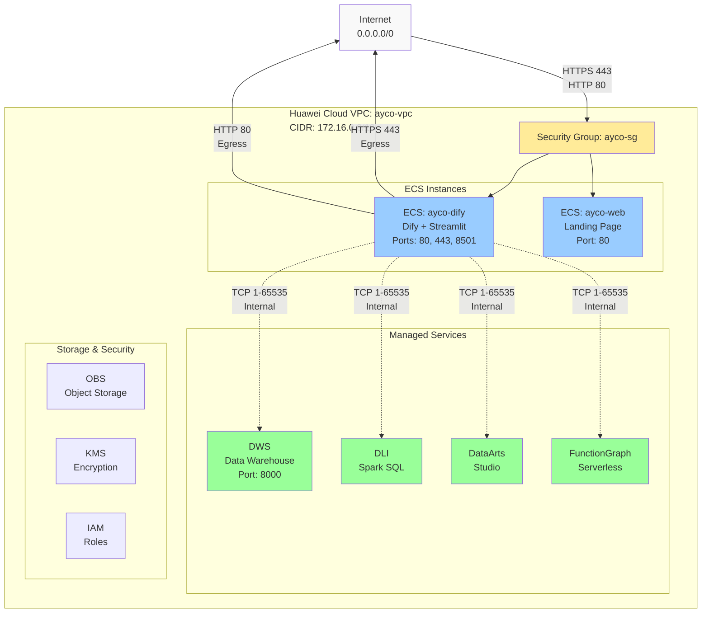
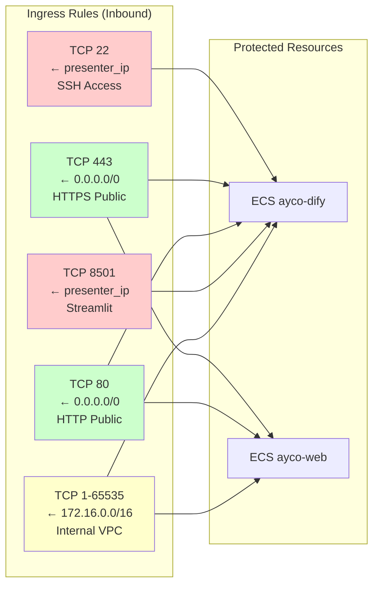
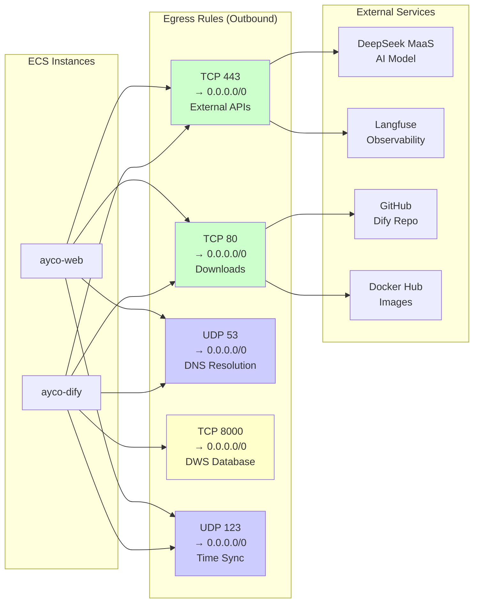
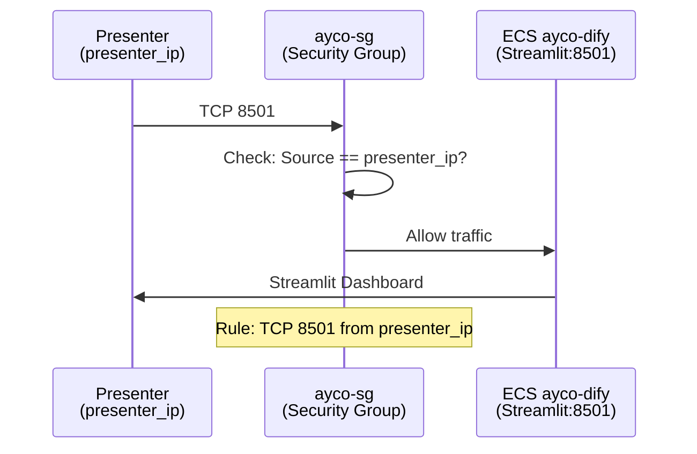
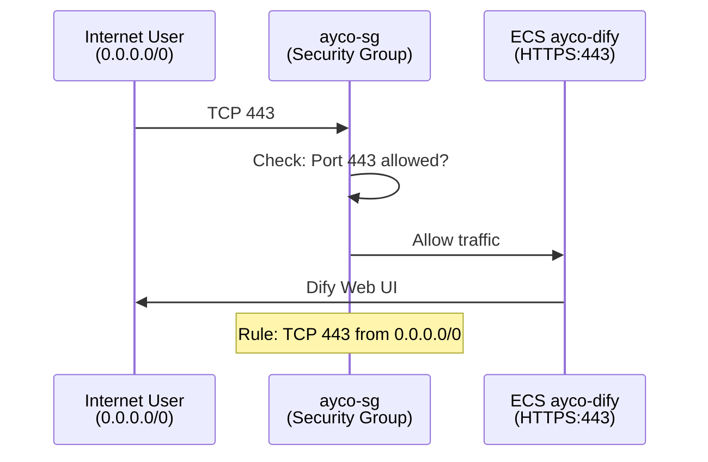
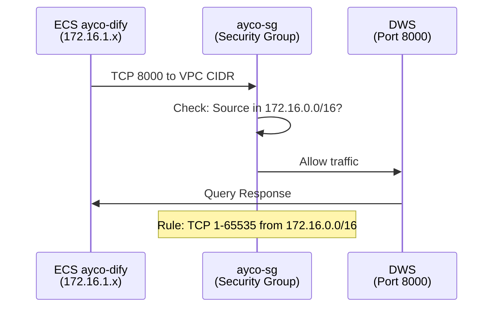
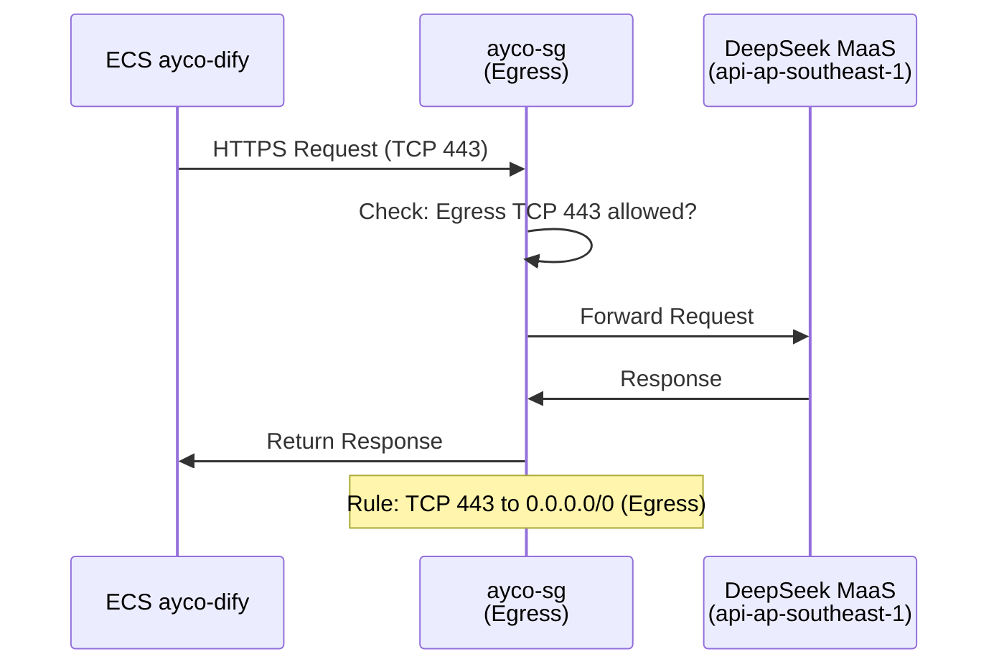
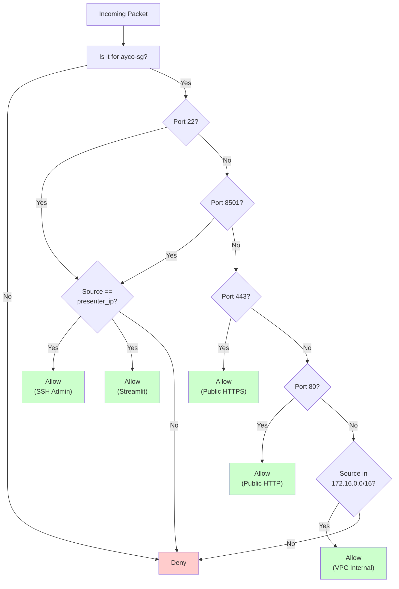

# AYCO Network Security - Mermaid Diagrams

This document contains Mermaid diagrams for the AYCO network architecture. These can be rendered in Markdown viewers that support Mermaid (GitHub, GitLab, Notion, etc.).

---

## Network Architecture Overview

---

## Security Group Rules

### Ingress Rules

### Egress Rules

---

## Traffic Flow Examples

### 1. Presenter Access to Streamlit Dashboard

### 2. Public HTTPS to Dify Web UI

### 3. Internal Service Communication (Dify ↔ DWS)

### 4. External API Call (Dify → DeepSeek MaaS)

---

## Security Group Decision Tree

---

## Port Access Matrix

| Port | Protocol | Direction | Source | Target | Purpose | Access Level |
|------|----------|-----------|--------|--------|---------|--------------|
| 22 | TCP | Ingress | presenter_ip | ECS | SSH | 🔒 Restricted |
| 80 | TCP | Ingress | 0.0.0.0/0 | ECS | HTTP | 🌐 Public |
| 443 | TCP | Ingress | 0.0.0.0/0 | ECS | HTTPS | 🌐 Public |
| 8501 | TCP | Ingress | presenter_ip | ECS | Streamlit | 🔒 Restricted |
| 1-65535 | TCP | Ingress | 172.16.0.0/16 | ECS | Internal | 🔒 VPC Only |
| 443 | TCP | Egress | ECS | 0.0.0.0/0 | APIs | 🌐 All |
| 80 | TCP | Egress | ECS | 0.0.0.0/0 | Downloads | 🌐 All |
| 53 | UDP | Egress | ECS | 0.0.0.0/0 | DNS | 🌐 All |
| 8000 | TCP | Egress | ECS | 0.0.0.0/0 | DWS | 🌐 All |
| 123 | UDP | Egress | ECS | 0.0.0.0/0 | NTP | 🌐 All |

---

**Related Documentation:**
- [`network-security.md`](./network-security.md) - Detailed security group reference
- [`architecture.md`](./architecture.md) - Overall system architecture
- [`README.md`](../README.md) - Project overview

---

**Note:** These diagrams use Mermaid syntax. View them in:
- GitHub (native rendering)
- GitLab (native rendering)
- Notion (with Mermaid plugin)
- VS Code (with Mermaid plugin)
- Online: https://mermaid.live
